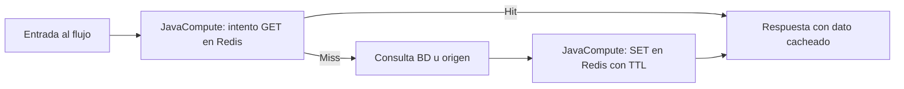

# Manual: Redis como caché en IBM App Connect Enterprise 12

Este manual describe, paso a paso, cómo hacer que un **message flow** en **ACE 12.x** use **Redis** como **caché** con el patrón **cache-aside** (lectura en caché primero; si no hay dato, consulta la fuente autoritativa y rellena la caché).

---

## 1. Contexto: ACE 12 y Redis

| Tema | Detalle |
|------|---------|
| **Versión** | IBM App Connect Enterprise **12.x** (Toolkit, Integration Server, BAR). |
| **Nodo Redis integrado** | **No existe** en ACE 12. El **Redis Request node** aparece a partir de **ACE 13.0.5**. En ACE 12 la integración directa se implementa con **JavaCompute** y un cliente Java (este manual usa **Jedis**). |
| **Alternativas** | Microservicio HTTP delante de Redis; otro cliente Java (p. ej. Lettuce). La vía Jedis es la más habitual en documentación y ejemplos de integración. |
| **App Connect (Designer)** | Si además usas flujos en **IBM App Connect** con Designer, el conector Redis sigue la guía [How to use IBM App Connect with Redis](https://www.ibm.com/docs/en/app-connect/12.0.x?topic=hga-redis-1). Eso **no sustituye** el mecanismo en ACE on‑prem descrito aquí. |

---

## 2. Arquitectura del patrón cache-aside



- **Hit:** la clave existe en Redis; se devuelve el valor sin pasar por la BD.  
- **Miss:** no hay clave (o expiró); se obtiene el dato del origen, se responde y se guarda en Redis con **TTL** para próximas peticiones.

---

## 3. Prerrequisitos

1. **Redis** instalado y accesible desde el host del **Integration Server** (puerto típico `6379`). Si aún no lo tienes, sigue la **Parte 1** del [`README.md`](../README.md) del repositorio.  
2. **IBM ACE 12** con Toolkit y un Integration Server de prueba.  
3. **JDK** alineado con el que usa tu instalación ACE 12 para compilación del código Java del flujo.  
4. Bibliotecas **Jedis** (y **Apache Commons Pool2** para pool de conexiones), en versiones compatibles con tu JDK (p. ej. Jedis 4.x con Java 8, Jedis 5.x con Java 11+).

---

## 4. Diseño de claves y TTL (antes de tocar el Toolkit)

Defínelo por escrito en la PoC:

- **Formato de clave:** `ace:<aplicacion>:<recurso>:<identificador>`  
  Ejemplo: `ace:pedidos:cliente:12345`  
- **TTL:** tiempo en segundos (p. ej. 300 = 5 minutos). Debe acotar memoria y staleness aceptable para el negocio.  
- **Valor:** cadena (JSON/XML/texto) acotada; evita almacenar filas enormes o BLOBs en Redis.

---

## 5. Preparar el proyecto Java en el Toolkit

### 5.1 Crear o reutilizar un proyecto de aplicación

1. **File → New → Application** (o abre la aplicación donde vivirá el flujo).  
2. Añade un **Java project** asociado al flujo: en el explorador, sobre la aplicación → **New → Java** (o la opción equivalente de tu versión del Toolkit para clases Java de message flow).

### 5.2 Añadir las dependencias JAR

Necesitas en el **Java Build Path** del proyecto (y posteriormente en el despliegue):

- `jedis-<version>.jar`  
- `commons-pool2-<version>.jar` (recomendado para `JedisPool`)

**Origen de los JAR:**

- Descarga desde [Maven Central](https://central.sonatype.com/) los artefactos `redis.clients:jedis` y `org.apache.commons:commons-pool2`, **o**  
- Construye un pequeño proyecto Maven/Gradle que los descargue y copia los JAR a una carpeta `jars/` referenciada por el proyecto ACE.

En el Toolkit: propiedades del proyecto Java → **Java Build Path → Libraries → Add External JARs** (o la ruta que use tu equipo para dependencias compartidas).

### 5.3 Empaquetado para el BAR

Los JAR deben incluirse en el **BAR** junto al flujo:

- En las propiedades de generación del BAR, incluye la biblioteca Java y marca la inclusión de dependencias según la práctica de tu versión (p. ej. **Java** y recursos asociados).  
- En el **Integration Server**, si usas un directorio de bibliotecas compartidas, coloca allí los JAR y configura la **carga de clases** según la documentación ACE para **user-defined jars** / **shared classes** de tu instalación.

> **Nota:** La ruta exacta en consola (`server.conf.yaml`, `overrides`, etc.) depende de si despliegas en contenedor o en servidor tradicional. Consulta la guía de despliegue de **Java dependencies** para tu fix pack de ACE 12.

---

## 6. Política definida por el usuario (recomendado para credenciales)

Para no hardcodear host, puerto y contraseña:

1. Crea un **Policy Project** y una **User-defined policy** (tipo que permita propiedades personalizadas, según tu versión de ACE 12).  
2. Define propiedades, por ejemplo: `redisHost`, `redisPort`, `redisPassword`, `redisDatabase`, `redisConnectionTimeoutMs`, `defaultTtlSeconds`.  
3. Asocia la política al **flujo** o al **JavaCompute** según permita tu versión.

En Java, puedes leer la política en tiempo de ejecución. IBM documenta el patrón en: [Accessing a user-defined policy from a JavaCompute node](https://www.ibm.com/docs/en/app-connect-enterprise/12.0.x?topic=java-accessing-user-defined-policy-from-javacompute-node).

Ejemplo **ilustrativo** (ajusta el tipo y nombre de política a lo que hayas creado en el Toolkit):

```java
MbPolicy pol = getPolicy("UserDefined", "{policyProject}:RedisCachePolicy");
String host = pol.getPropertyValue("redisHost");
String port = pol.getPropertyValue("redisPort");
// ...
```

Si no usas políticas en la primera iteración, usa propiedades del nodo **JavaCompute** (`Configurable Properties`) y lee con `getUserDefinedAttribute("redisHost")` u mecanismo equivalente documentado para ACE 12.

---

## 7. Configurar el `JavaCompute`: dos terminales de salida

Para separar **hit** y **miss** sin lógica frágil en ESQL:

1. En el **Message Flow**, coloca el primer **JavaCompute** (p. ej. `RedisCacheGet`).  
2. Abre sus propiedades y **añade un terminal de salida adicional** llamado exactamente `miss` (nombre coherente con el código de la sección 8).  
3. Conecta:
   - Terminal por defecto **`out`** → nodo que construye la **respuesta al cliente** (hit).  
   - Terminal **`miss`** → cadena que consulta la **BD** (o servicio) → segundo **JavaCompute** que hace **SET** en Redis → mismo camino de respuesta.

Si el Toolkit no permite renombrar el terminal por defecto, mantén el nombre que exige la API: el terminal adicional debe coincidir con `getOutputTerminal("miss")`.

---

## 8. Código Java de referencia

Los fragmentos siguientes son una **base** para la PoC: debes alinear el **árbol de mensajes** (JSON Domain, XML, DFDL, etc.) con el parser de tu flujo y compilar en el Toolkit con el **JDK** que corresponda a tu fix pack de ACE 12.

La configuración del nodo se lee con **`MbNode.getUserDefinedAttribute(String)`**, documentada para propiedades definidas por el usuario en el JavaCompute. Si usas **User-defined policy**, obtén primero un `MbPolicy` como indica IBM y lee sus propiedades en lugar de los atributos del nodo.

### 8.0 Pool compartido (`RedisPoolHolder`)

Un solo pool por combinación host/puerto/base (ajusta si necesitas recargar credenciales en caliente).

```java
package com.example.ace.redis;

import com.ibm.broker.plugin.MbException;
import com.ibm.broker.plugin.MbNode;
import redis.clients.jedis.JedisPool;
import redis.clients.jedis.JedisPoolConfig;
import redis.clients.jedis.Jedis;

public final class RedisPoolHolder {

    private static volatile JedisPool pool;
    private static volatile String signature = "";

    private RedisPoolHolder() {}

    public static JedisPool poolFor(MbNode node) throws MbException {
        String host = attr(node, "redisHost", "127.0.0.1");
        String port = attr(node, "redisPort", "6379");
        String password = attr(node, "redisPassword", "");
        String db = attr(node, "redisDatabase", "0");
        String timeout = attr(node, "redisConnectionTimeoutMs", "2000");
        String sig = host + "|" + port + "|" + db + "|" + password;

        JedisPool p = pool;
        if (p != null && sig.equals(signature)) {
            return p;
        }
        synchronized (RedisPoolHolder.class) {
            if (pool != null && sig.equals(signature)) {
                return pool;
            }
            if (pool != null) {
                pool.close();
                pool = null;
            }
            int portNum = Integer.parseInt(port);
            int timeoutMs = Integer.parseInt(timeout);
            int database = Integer.parseInt(db);

            JedisPoolConfig cfg = new JedisPoolConfig();
            cfg.setMaxTotal(32);
            cfg.setMaxIdle(8);

            if (password != null && !password.isEmpty()) {
                pool = new JedisPool(cfg, host, portNum, timeoutMs, timeoutMs, password, database);
            } else {
                pool = new JedisPool(cfg, host, portNum, timeoutMs, null, database);
            }
            signature = sig;
            return pool;
        }
    }

    private static String attr(MbNode node, String name, String def) throws MbException {
        Object v = node.getUserDefinedAttribute(name);
        if (v == null) {
            return def;
        }
        String s = String.valueOf(v).trim();
        return s.isEmpty() ? def : s;
    }
}
```

### 8.1 Clase `RedisCacheGet` (GET + ruta hit/miss)

**Paquete y nombre de clase** deben coincidir con el JavaCompute en el flujo. Añade el terminal de salida adicional **`miss`**.

```java
package com.example.ace.redis;

import com.ibm.broker.javacompute.MbJavaComputeNode;
import com.ibm.broker.plugin.*;
import redis.clients.jedis.JedisPool;
import redis.clients.jedis.Jedis;

public class RedisCacheGet extends MbJavaComputeNode {

    @Override
    public void evaluate(MbMessageAssembly assembly) throws MbException {
        MbOutputTerminal out = getOutputTerminal("out");
        MbOutputTerminal miss = getOutputTerminal("miss");

        try {
            MbMessage in = assembly.getMessage();
            MbElement root = in.getRootElement();

            String cacheKey = buildCacheKey(root);
            if (cacheKey == null || cacheKey.isEmpty()) {
                miss.propagate(assembly);
                return;
            }

            JedisPool p = RedisPoolHolder.poolFor(getNode());

            try (Jedis jedis = p.getResource()) {
                String cached = jedis.get(cacheKey);
                if (cached != null) {
                    writeBodyFromCache(in, cached);
                    setCacheFlag(assembly, true);
                    out.propagate(assembly);
                    return;
                }
            }

            setCacheFlag(assembly, false);
            putRedisCacheKey(assembly, cacheKey);
            miss.propagate(assembly);

        } catch (Exception e) {
            MbOutputTerminal failure = getOutputTerminal("failure");
            if (failure != null && failure.isAttached()) {
                failure.propagate(assembly);
            } else {
                miss.propagate(assembly);
            }
        }
    }

    private String buildCacheKey(MbElement root) throws MbException {
        // PoC: adaptar al XPath real de tu mensaje (JSON/XML)
        MbElement id = root.getFirstElementByPath("/JSON/Data/Id");
        if (id == null) {
            id = root.getFirstElementByPath("/Root/Id");
        }
        if (id == null) {
            return null;
        }
        return "ace:demo:entity:" + id.getValueAsString();
    }

    private void writeBodyFromCache(MbMessage in, String cached) throws MbException {
        MbElement root = in.getRootElement();
        MbElement body = root.getFirstElementByPath("/JSON/Data");
        if (body != null) {
            body.setValue(cached);
            return;
        }
        // Si no usas JSON en Data, reemplaza por reconstrucción del parser que use el flujo
        in.reset(null, null);
        MbElement jsonRoot = in.getRootElement().createElementAsLastChild(
            MbJSON.JSON_ROOT_ELEMENT_NAME, MbJSON.JSON_ROOT_ELEMENT_TYPE, null);
        jsonRoot.createElementAsLastChild(MbElement.TYPE_NAME_VALUE, "payload", cached);
    }

    private void setCacheFlag(MbMessageAssembly assembly, boolean hit) throws MbException {
        MbElement env = assembly.getLocalEnvironment().getRootElement();
        MbElement vars = env.getFirstElementByPath("/Variables");
        if (vars == null) {
            vars = env.createElementAsLastChild(MbElement.TYPE_NAME, "Variables", null);
        }
        MbElement redis = vars.getFirstElementByPath("Redis");
        if (redis == null) {
            redis = vars.createElementAsLastChild(MbElement.TYPE_NAME, "Redis", null);
        }
        MbElement flag = redis.getFirstElementByPath("cacheHit");
        if (flag == null) {
            flag = redis.createElementAsLastChild(MbElement.TYPE_NAME_VALUE, "cacheHit", null);
        }
        flag.setValue(hit ? "true" : "false");
    }

    private void putRedisCacheKey(MbMessageAssembly assembly, String cacheKey) throws MbException {
        MbElement env = assembly.getLocalEnvironment().getRootElement();
        MbElement vars = env.getFirstElementByPath("/Variables");
        if (vars == null) {
            vars = env.createElementAsLastChild(MbElement.TYPE_NAME, "Variables", null);
        }
        MbElement keyEl = vars.getFirstElementByPath("redisCacheKey");
        if (keyEl == null) {
            keyEl = vars.createElementAsLastChild(MbElement.TYPE_NAME_VALUE, "redisCacheKey", null);
        }
        keyEl.setValue(cacheKey);
    }
}
```

### 8.2 Clase `RedisCachePut` (SET con TTL tras la BD)

```java
package com.example.ace.redis;

import com.ibm.broker.javacompute.MbJavaComputeNode;
import com.ibm.broker.plugin.*;
import redis.clients.jedis.JedisPool;
import redis.clients.jedis.Jedis;

public class RedisCachePut extends MbJavaComputeNode {

    @Override
    public void evaluate(MbMessageAssembly assembly) throws MbException {
        MbOutputTerminal out = getOutputTerminal("out");
        try {
            MbElement env = assembly.getLocalEnvironment().getRootElement();
            MbElement keyEl = env.getFirstElementByPath("/Variables/redisCacheKey");
            String cacheKey = keyEl != null ? keyEl.getValueAsString() : null;

            if (cacheKey == null || cacheKey.isEmpty()) {
                out.propagate(assembly);
                return;
            }

            String payload = extractPayloadForCache(assembly.getMessage());
            Object ttlObj = getNode().getUserDefinedAttribute("defaultTtlSeconds");
            int ttl = Integer.parseInt(ttlObj != null ? String.valueOf(ttlObj).trim() : "300");

            JedisPool p = RedisPoolHolder.poolFor(getNode());
            try (Jedis jedis = p.getResource()) {
                jedis.setex(cacheKey, ttl, payload);
            }
            out.propagate(assembly);
        } catch (Exception e) {
            MbOutputTerminal failure = getOutputTerminal("failure");
            if (failure != null && failure.isAttached()) {
                failure.propagate(assembly);
            } else {
                out.propagate(assembly);
            }
        }
    }

    private String extractPayloadForCache(MbMessage msg) throws MbException {
        MbElement root = msg.getRootElement();
        MbElement body = root.getFirstElementByPath("/JSON/Data");
        return body != null ? body.getValueAsString() : root.getValueAsString();
    }
}
```

**Coherencia:** `RedisCacheGet` guarda la clave en `LocalEnvironment.Variables.redisCacheKey` para que `RedisCachePut` use la **misma** clave tras la BD. El **payload** serializado en `SET` debe ser el que `writeBodyFromCache` vuelva a colocar en el mensaje en un **hit**.

> **Compilación:** revisa en la ayuda de tu ACE 12 los nombres exactos de constantes (`MbElement.TYPE_NAME`, `MbJSON`, etc.) y el **namespace** del árbol `LocalEnvironment` si los `getFirstElementByPath` no encuentran `Variables` (algunos entornos usan prefijos XML en el entorno local).

---

## 9. Propiedades configurables del nodo (Toolkit)

En el **JavaCompute → User-defined properties** (o el panel equivalente), define al menos:

| Nombre | Ejemplo | Uso |
|--------|---------|-----|
| `redisHost` | `redis.lab.corp` | Hostname o IP |
| `redisPort` | `6379` | Puerto |
| `redisPassword` | `***` | Vacío si no hay auth |
| `redisDatabase` | `0` | Índice DB Redis |
| `redisConnectionTimeoutMs` | `2000` | Timeout de conexión |
| `defaultTtlSeconds` | `300` | TTL del SET tras miss |

---

## 10. Montaje del message flow (resumen)

1. **HTTP Input** (o MQInput, etc.) → **RedisCacheGet** (`out` / `miss`).  
2. **`out`** → transformación mínima si hace falta → **HTTP Reply** (o siguiente nodo).  
3. **`miss`** → **Database** o **Mapping + servicio** que obtiene el dato autoritativo.  
4. Salida de la BD → **RedisCachePut** → **HTTP Reply**.

Añade **TryCatch** / **Failure** según estándares de tu equipo y conecta el terminal **failure** de los JavaCompute a registro y respuesta de error.

---

## 11. Pruebas

1. Desde el cliente, primera petición: debe ir a la BD y poblar Redis (`redis-cli MONITOR` o `GET ace:demo:entity:123`).  
2. Segunda petición idéntica: debe salir por el terminal **hit** sin consulta a BD (ver logs o trazas en la BD).  
3. Tras expirar el TTL, debe repetirse el ciclo miss → BD → set.

Comandos útiles en el servidor Redis:

```bash
redis-cli KEYS 'ace:demo:*'
redis-cli TTL ace:demo:entity:123
```

---

## 12. Observabilidad y PoC

- Registra en log **hit/miss** (con moderación para no saturar).  
- Mide latencia end-to-end y **consultas a la BD** con y sin caché (véase Parte 3 del [`README.md`](../README.md)).  
- Calcula **hit ratio** = hits / (hits + misses) en un periodo de prueba estable.

---

## 13. Problemas frecuentes

| Síntoma | Causa probable |
|---------|----------------|
| `ClassNotFoundException: redis.clients.jedis` | JAR no incluido en el BAR o no visible para el Integration Server. |
| Timeout al conectar | Firewall, `bind` en Redis, host incorrecto, Redis caído. |
| Siempre miss | Clave distinta entre GET y SET, serialización distinta del payload, TTL 0. |
| Fugas de conexiones | No usar `new Jedis()` por mensaje sin cerrar; usar **pool** y `try-with-resources`. |

---

## 14. Evolución a ACE 13.0.5+

Si migras a **ACE 13.0.5 o superior**, valorar el **Redis Request node** y políticas de conexión Redis mantenidas por IBM para reducir código Java y simplificar operaciones. El diseño de **claves y TTL** de este manual sigue siendo válido.

---

## Referencias

- IBM ACE 12 — JavaCompute y políticas: [Accessing a user-defined policy from a JavaCompute node](https://www.ibm.com/docs/en/app-connect-enterprise/12.0.x?topic=java-accessing-user-defined-policy-from-javacompute-node)  
- IBM App Connect 12.0.x — conector Redis (ecosistema Designer): [How to use IBM App Connect with Redis](https://www.ibm.com/docs/en/app-connect/12.0.x?topic=hga-redis-1)  
- Redis: [https://redis.io/docs/](https://redis.io/docs/)
